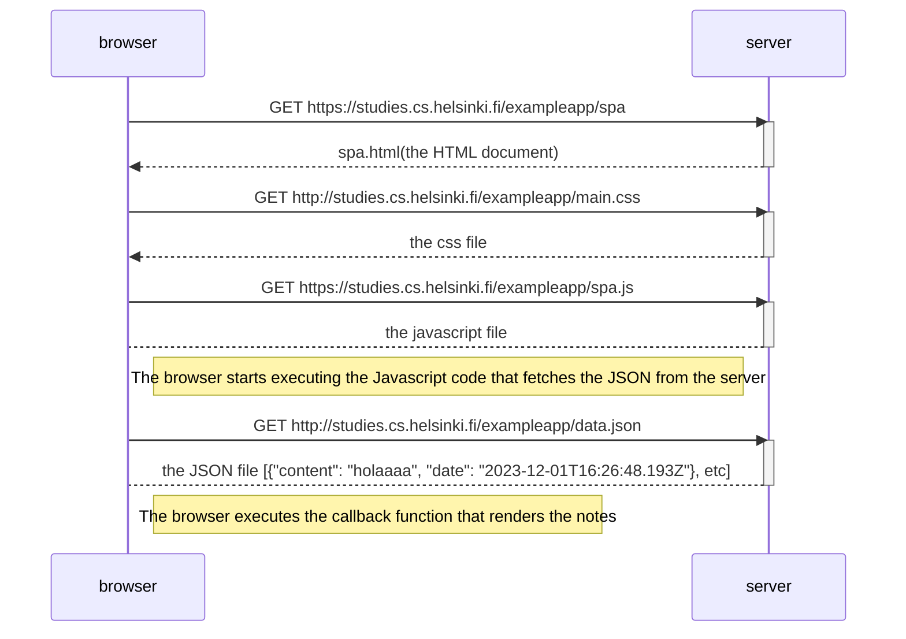

```mermaid
sequenceDiagram
    participant browser
    participant server

browser->>server: GET https://studies.cs.helsinki.fi/exampleapp/spa
activate server
server-->>browser: spa.html(the HTML document)
deactivate server

browser->>server: GET http://studies.cs.helsinki.fi/exampleapp/main.css
activate server
server-->>browser: the css file
deactivate server

browser->>server: GET https://studies.cs.helsinki.fi/exampleapp/spa.js
activate server
server-->browser: the javascript file
deactivate server
Note right of browser: The browser starts executing the Javascript code that fetches the JSON from the server

browser->>server: GET http://studies.cs.helsinki.fi/exampleapp/data.json
activate server
server-->browser: the JSON file [{"content": "holaaaa", "date": "2023-12-01T16:26:48.193Z"}, etc]
deactivate server

Note right of browser: The browser executes the callback function that renders the notes
```
