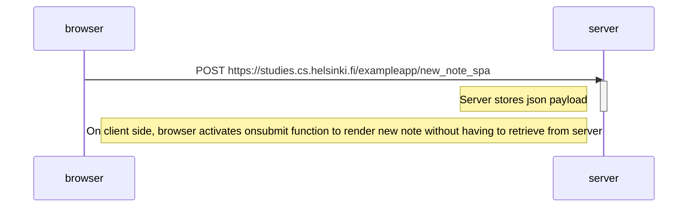

```mermaid
sequenceDiagram
    participant browser
    participant server

browser->>server: POST https://studies.cs.helsinki.fi/exampleapp/new_note_spa
activate server
Note left of server: Server stores json payload
deactivate server
Note right of browser: On client side, browser activates onsubmit function to render new note without having to retrieve from server

```
